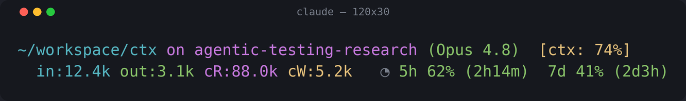
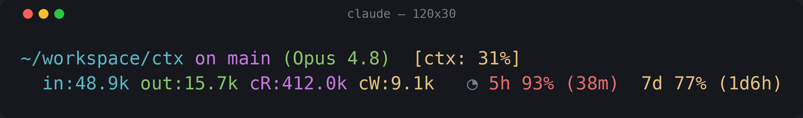
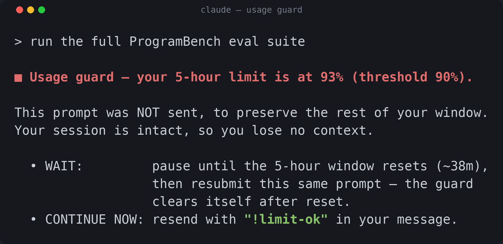

# Rate Limit Monitor

**Never get cut off mid-task by your Claude Code usage limits again.**

A tiny [Claude Code](https://code.claude.com) plugin that shows your **5-hour**
and **7-day** usage windows right in the statusline, and — when you're about to
run out — **stops the next prompt** so you don't spend the last of your window
on a long, token-heavy task.

<p align="center">
  
</p>

Healthy usage: green. It shows the percentage used and a countdown to reset
(`5h 62% (2h14m)`). As you climb it turns yellow approaching the threshold and
red at it (with the default threshold: yellow ≥72%, red ≥90%):

<p align="center">
  
</p>

And the moment you try to kick off new work at or above the threshold, the guard
steps in — your session stays completely intact, so you lose no context:

<p align="center">
  
</p>

You choose:

- **Continue** — just send the **same prompt again** (press ↑ then Enter). The
  guard treats an identical resubmit as "yes, go", and won't ask again until that
  window resets — so you confirm only **once per window**, and nothing extra ends
  up in your prompt. (Including `!limit-ok` anywhere still works too, and also
  approves the window.)
- **Wait** for the window to reset, then resubmit — the guard **clears itself
  automatically** once the reset time passes.

This same approval also frees the **loop guard** below, so an already-running
multi-step task continues uninterrupted.

---

## Quickstart

Clone it and run the installer — that's the whole thing:

```bash
git clone https://github.com/meitalbensinai/rate-limit-monitor
bash rate-limit-monitor/install.sh
# then restart Claude Code
```

`install.sh` is safe and idempotent: it backs up `settings.json` and wires the
statusline + guard **without clobbering** any statusline/hooks you already have.
Undo any time with `bash rate-limit-monitor/uninstall.sh`.

> **Handing this to an AI coding agent?** Just say *"install this repo."* The
> agent reads [`AGENTS.md`](AGENTS.md), runs `./install.sh`, and tells you to
> restart. Nothing else to explain.

---

## Why two pieces?

Claude Code hands the *official* rate-limit numbers (`rate_limits.five_hour.used_percentage`
and `resets_at`) **only to the statusline** — `UserPromptSubmit` hooks never see
them. So the two components cooperate:

```
 ┌─────────────┐  official rate_limits   ┌──────────────────────────┐
 │  Claude Code │ ──────────────────────▶ │  statusline script       │
 └─────────────┘      (every turn)        │  • renders the segment   │
                                          │  • writes state to a file│
                                          └───────────┬──────────────┘
                                                      │ ~/.claude/.rate-limit-state.json
                                                      ▼
                                          ┌──────────────────────────┐
                       your next prompt ─▶│  UserPromptSubmit guard   │
                                          │  reads state → block/allow│
                                          └──────────────────────────┘
```

No transcript parsing, no token estimation — it's the real number, straight from
Anthropic.

## Requirements

- **A subscription plan** (Pro / Max / Team / Enterprise). The `rate_limits` data
  only exists on those plans, and only *after* the first API response of a
  session. Before that (and for API-key users) the guard simply allows
  everything — it fails **open**, never blocks you by mistake.
- **`jq`** on your `PATH` (`brew install jq` / `apt install jq`).

## Install

### Recommended: the installer

```bash
bash ./install.sh      # from the cloned repo
```

It wires both the statusline and the guard, chaining any existing statusline and
preserving your other hooks. Restart Claude Code afterwards.

### Alternative: the plugin marketplace (guard only) + manual statusline

Prefer Claude Code's native plugin flow? The guard hook can be installed that way:

```
/plugin marketplace add meitalbensinai/rate-limit-monitor
/plugin install rate-limit-monitor@rate-limit-monitor
```

Plugins can't ship a statusline, so add that one yourself in
`~/.claude/settings.json` (chain your existing one via `RLM_INNER_STATUSLINE`):

```json
{
  "statusLine": {
    "type": "command",
    "command": "RLM_INNER_STATUSLINE='bash ~/.claude/statusline-command.sh' bash /ABS/PATH/rate-limit-monitor/statusline/rate-limit-statusline.sh"
  }
}
```

Drop the `RLM_INNER_STATUSLINE=...` prefix if you have no existing statusline.
Don't use *both* routes at once — that wires the guard twice. Restart Claude Code
after editing settings; statusline and hooks are read at session start.

## Configuration

Everything is tuned with environment variables (set them inline in the statusline
command, or export them in your shell profile):

| Variable               | Default                             | Meaning                                            |
| ---------------------- | ----------------------------------- | -------------------------------------------------- |
| `RLM_THRESHOLD`        | `90`                                | Block prompts (and deny loop tool calls) at/above this percent. |
| `RLM_OVERRIDE`         | `!limit-ok`                         | Legacy phrase that forces a prompt through and approves the window. |
| `RLM_GUARD_LOOP`       | `1`                                 | Also gate the model's agentic loop; set `0` to disable. |
| `RLM_WINDOWS`          | `both`                              | Which windows guard: `5h`, `7d`, or `both`.        |
| `RLM_STATE_FILE`       | `~/.claude/.rate-limit-state.json`  | Shared usage state file (statusline → hooks).      |
| `RLM_ACK_FILE`         | `~/.claude/.rate-limit-ack.json`    | Per-window approval state; survives the statusline's per-turn rewrites. |
| `RLM_INNER_STATUSLINE` | *(none)*                            | A statusline command to render before this one.    |

## How the guard behaves

- **Two checkpoints.** The `UserPromptSubmit` guard fires when you submit a
  prompt — a checkpoint before new work starts. The optional `PreToolUse` **loop
  guard** (`RLM_GUARD_LOOP`, on by default) fires before each tool call, so a
  single long, multi-step model turn can't quietly drain your window either — it
  gets paused and handed back to you.
- **Approve once per window, without touching the prompt.** Resubmit the same
  prompt to confirm; the approval is remembered until that window resets, and the
  loop guard honors it too, so the run continues uninterrupted. A hook can't pop
  an interactive dialog, so the block message *is* the question: wait, or resubmit
  to continue.
- **Self-clearing.** Once the clock passes the window's `resets_at`, the stored
  reading is stale and you're allowed through — "wait then continue" needs no
  manual step.
- **Freshness of the loop guard.** `PreToolUse` hooks don't receive `rate_limits`;
  the loop guard reads the state file the statusline writes, so it reacts about as
  fast as the statusline refreshes, not instantly on every tool call.

## License

MIT © meital
